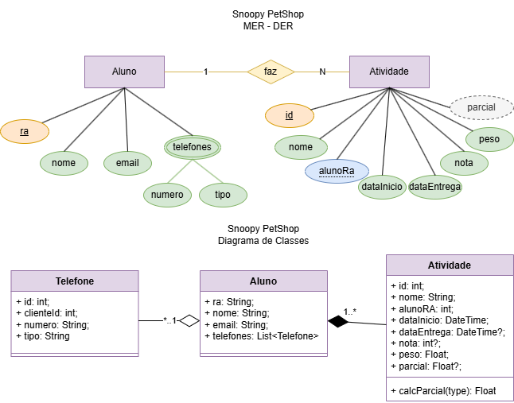

# ATIVIDADES ESCOLA ACME API
Situação de Aprendizagem - Back-End (Node.JS, JavaSript, VsCode, ORM Prisma, Insomnia)

## Contextualização
A ESCOLA ACME tem atuado em nossa cidade com ótimo atendimento e confiabilidade, é nossa cliente e necessita de um sistema Web para registro das atividades e notas de seus alunos.<br>O P.O. após uma visita ao cliente, elaborou o DER e UML DC(Diagrama de Classes) a seguir e elencou os requisitos funcionais.<br>


## Desafio
Desenvolver as funcionalidades conforme requisitos

### Requisitos funcionais
- [RF001] O sistema deve permitir o CRUD de Alunos.
    - [RF001.1] O sistema deve permitir o CRUD de telefones, pois cada **aluno** pode possuir 0 ou vários telefones de tipos diferentes como celular, fixo ou comercial.
    - [RF001.2] A rota **read** do **aluno** deve mostrar os dados de todos os alunos e seus respectivos telefones.
    - [RF001.3] A rota **readOne** do **aluno** deve mostrar os dados de um aluno específico, seus telefones e suas **atividades**.
- [RF002] O sistema deve permitir o CRUD de Atividades.
    - [RF002.1] O sistema deve associar a atividade a um aluno.
    - [RF002.2] Ao cadastrar uma nova atividade **create** no controller, a dataInicio deve ser gerada pelo Banco de Dados @dedault(now()).
    - [RF002.3] Ao cadastrar uma nova atividade **create** no controller, a dataEntrega, a nota e a parcial podem ser nulas **"?"** pois serão preenchidas na rota **update** quando o aluno entregar e o professor corrigir.
    - [RF002.4] Se ao realizar **update** o campo **nota** for enviado o sistema deve calcular a **parcial** com a formula **"nota * peso / 10"**.

### Casos de teste (Insomnia)
- [CT001] Deve ser cadastrado pelo menos 5 alunos.
- [CT002] Deve ser cadastrado ao menos 1 telefone para cada aluno.
    - [CT002.1] Pelo menos dois alunos devem ter dois ou mais telefones cadastrados.
- [CT003] Cadastre, altere e exclua um aluno.
- [CT004] Cadastre uma atividade para cada aluno.
    - [CT004.1] Pelo menos um aluno deve ter duas ou mais atividades cadastradas.
- [CT005] Cadastre, altere e exclua uma atividade.

## Tecnologias

## Passo a Passo de como executar a API

### 1. **Pré-requisitos**
Antes de iniciar, é necessário ter instalado as seguintes ferramentas no seu computador:

- **Node.js** (recomendado versão LTS)
- **npm** (gerenciador de pacotes do Node.js)
- **VS Code** (editor de código recomendado, mas pode ser usado qualquer editor de sua preferência)
- **Insomnia** (para testar as rotas da API)
- **Prisma ORM** (para interagir com o banco de dados)

### 2. **Clone o repositório**
Primeiramente, você precisa clonar o repositório do projeto para a sua máquina local. Abra o terminal e execute o comando:
```bash
cd api
npm install
npm i prisma -g
npx prisma migrate dev --name init
npx nodemon
# ou
npm start
```
- 6 Abra o Insomnia e importe o arquivo **./docs/insomnia.yaml** para realizar os testes.
```bash
git clone https://github.com/seu-usuario/projeto-escola-acme.git

